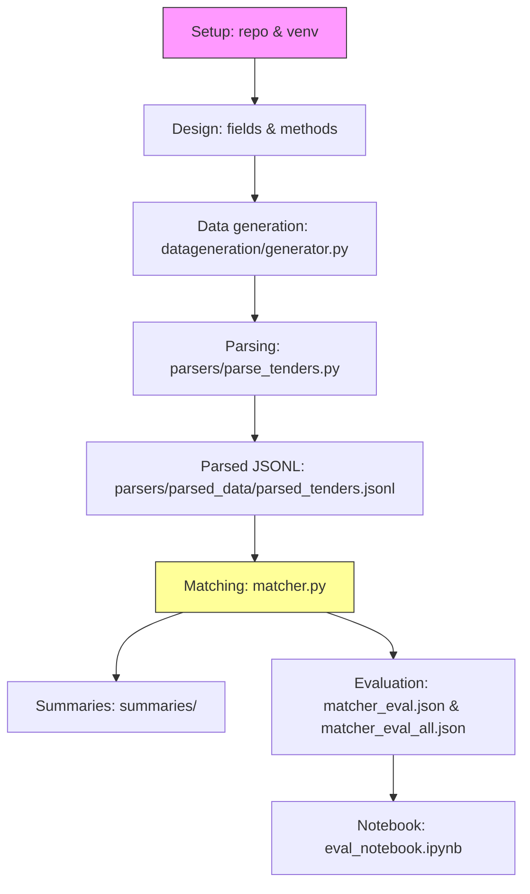

# Process Log — Project Build Timeline

This document captures the sequence of steps taken to build the Multilingual Grant & Tender Matcher project.

## High-level timeline

- Setup project structure and linked repository (GitHub).
- Reviewed project goals and technical requirements.
- Generated synthetic dataset (tenders in .txt/.html/.pdf, profiles, gold matches).
- Implemented parser to extract structured fields and normalize budgets.
- Built matcher pipelines: TF‑IDF, BM25, and a combined scorer; added boilerplate stripping and budget-fit boosting.
- Created summary generator (multilingual, ≤80 words) and wrote per-profile summaries.
- Ran evaluation runs, produced `matcher_eval.json` and `matcher_eval_all.json` and added `eval_notebook.ipynb`.

## Detailed steps

1. Setup
	- Initialized repository and local workspace.
	- Created virtual environment and installed dependencies.
	- Pushed initial code to GitHub and created README skeleton.

2. Understand & design
	- Defined required fields for tenders: `title`, `sector`, `budget`, `deadline`, `eligibility`, `region`, `description`.
	- Chose matching approaches: TF‑IDF + cosine, BM25, and optional combination using normalized scores.

3. Data generation
	- Implemented `datageneration/generator.py` to synthesize 40 tenders in `.txt`, `.html`, `.pdf` and profiles.
	- Ensured language mix (60% English, 40% French) and included required fields in templates.

4. Parser
	- Implemented `parsers/parse_tenders.py` to read all formats (PyPDF2, BeautifulSoup, text parsing).
	- Extracted a multi-line `Description` block and normalized `budget_value` (numeric) for scoring.
	- Wrote output to `parsers/parsed_data/parsed_tenders.jsonl`.

5. Matcher
	- Implemented `matcher.py` with `run_tfidf()`, `run_bm25()`, and `run_combined()` functions.
	- Added `doc_text()` fallback to load Description from files when missing.
	- Added `strip_boilerplate()` to remove repetitive application instructions before vectorization.
	- Added budget-fit boost and per-profile normalization for combined scoring.
	- Default method set to `bm25` after initial evaluation.

6. Summaries & evaluation
	- `generate_summary()` creates ≤80-word multilingual explanations citing sector, budget fit, deadline, and matched terms.
	- Saved per-profile summary files under `summaries/`.
	- Created `matcher_eval.json` and `matcher_eval_all.json` with MRR@5 and Recall@5 metrics.
	- Added `eval_notebook.ipynb` to display results and confusion cases.

## Diagram (Mermaid)

## Notes & next actions

- Consider adding `requirements.txt` to pin versions used in evaluation.
- Add `run_all.ps1` or `run_all.sh` to automate generator → parser → matcher → eval.
- Tune `strip_boilerplate()` patterns or run grid search on `w_tfidf`, `w_bm25`, and `alpha` to improve MRR.

---

Last updated: 2026-04-23
